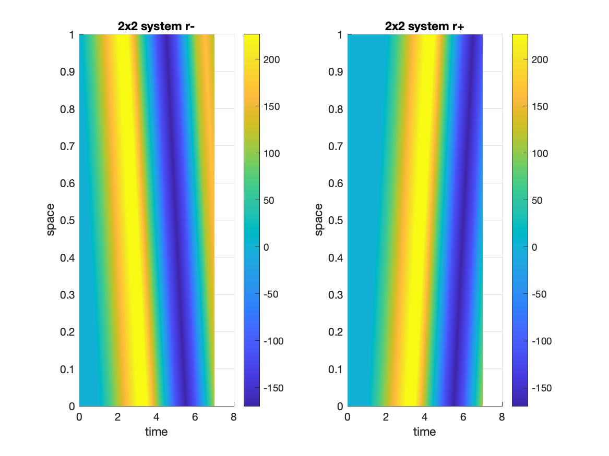

# Transport-equation
Some simulations involving the transport equation (/pure convection) and 2x2 hyperbolic systems.

Some pictures:

* two transport equations coupled at the boundary at $x=\ell$:

&nbsp;&nbsp;&nbsp;&nbsp;&nbsp;&nbsp; 

* 2x2 linear hyperbolic system with a force applied at $x=\ell$ on the second equation:

&nbsp;&nbsp;&nbsp;&nbsp;&nbsp;&nbsp; 

&nbsp;&nbsp;&nbsp;&nbsp;&nbsp;&nbsp;  &nbsp;&nbsp;&nbsp;&nbsp; 
